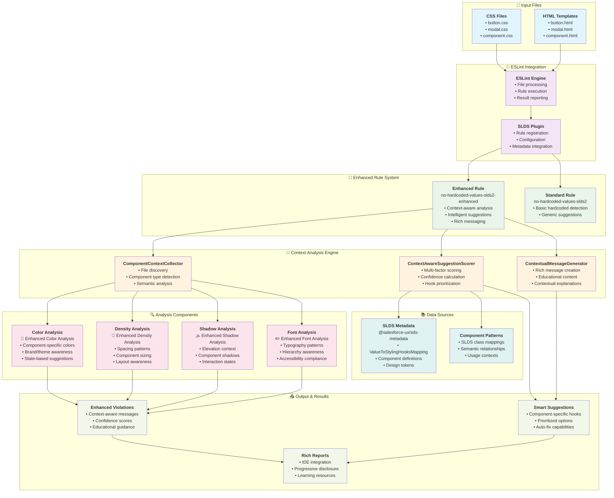
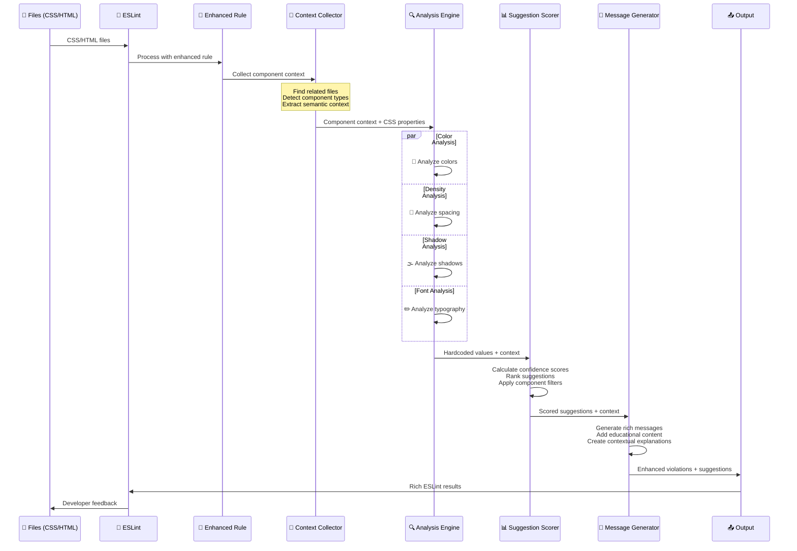
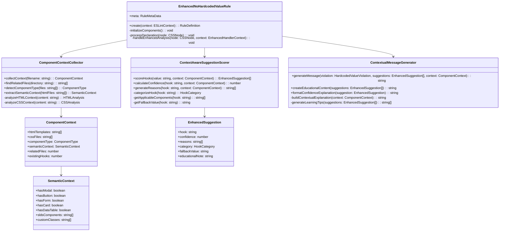
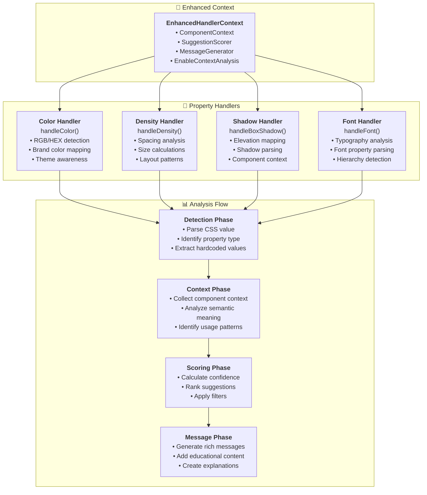
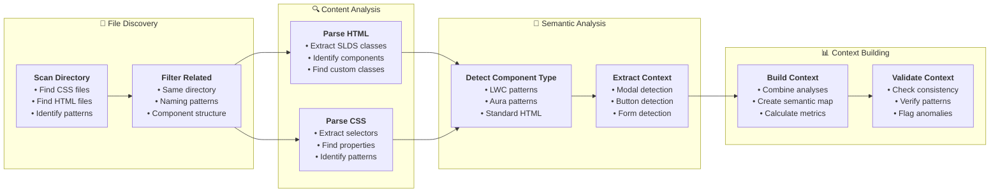
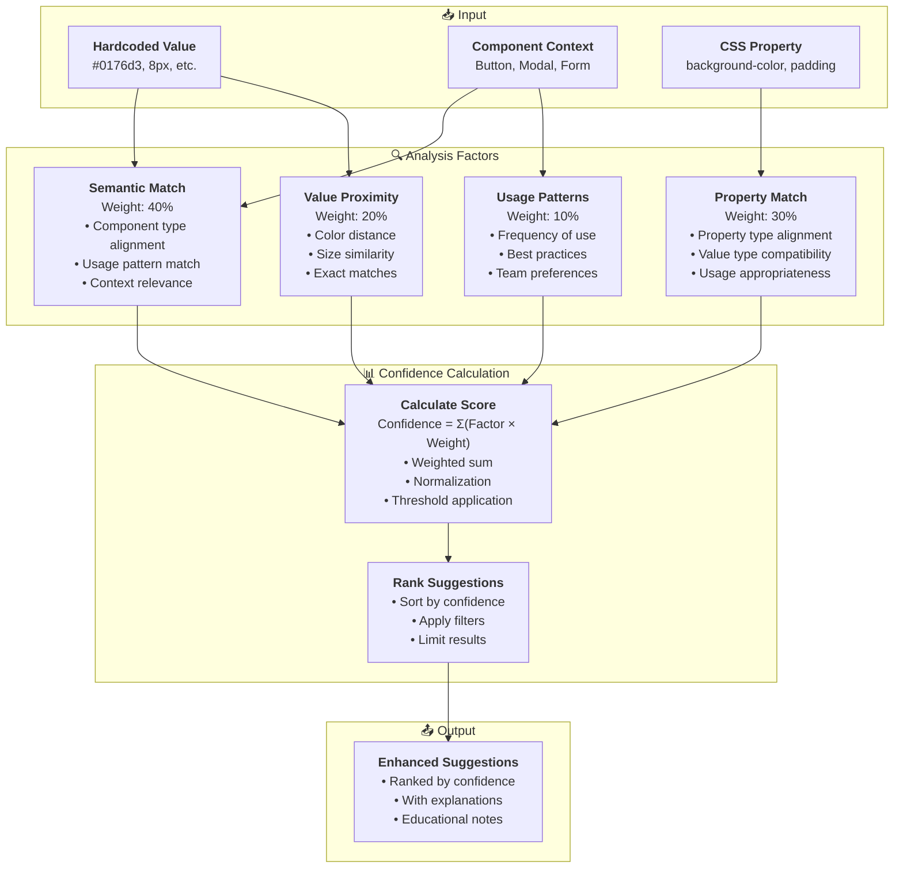
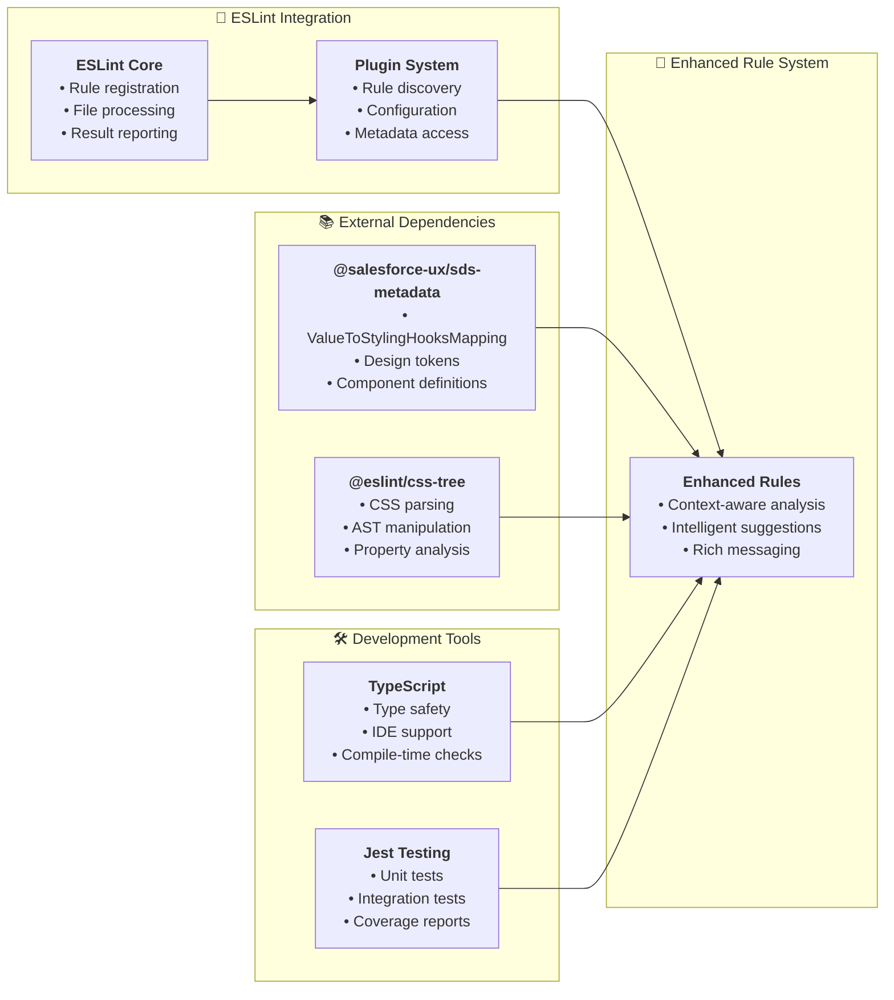
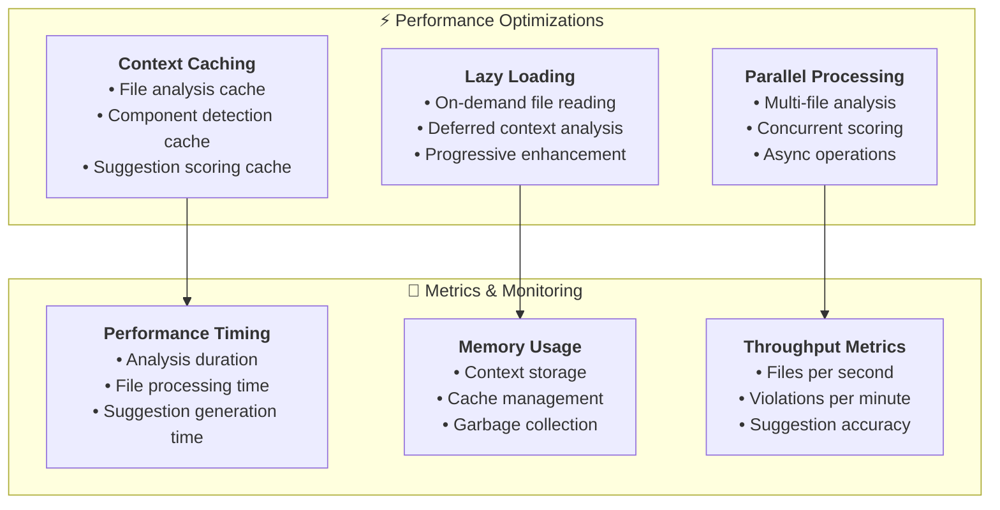

# 🏗️ Context-Aware Linting Architecture

## 📊 System Overview Diagram



## 🔄 Data Flow Diagram



## 🏛️ Component Architecture



## 🔧 Handler Architecture



## 🎨 Context Analysis Pipeline



## 🎯 Suggestion Scoring Algorithm



## 🏗️ File Structure Architecture

```
packages/eslint-plugin-slds/
├── 📁 src/
│   ├── 📁 rules/v9/no-hardcoded-values/
│   │   ├── 📄 no-hardcoded-values-slds2.ts              # Standard rule
│   │   ├── 📄 no-hardcoded-values-slds2-enhanced.ts     # Enhanced rule
│   │   ├── 📄 noHardcodedValueRule.ts                   # Base rule logic
│   │   └── 📄 enhancedNoHardcodedValueRule.ts           # Enhanced base logic
│   ├── 📁 utils/
│   │   ├── 📄 component-context-collector.ts            # Context collection
│   │   ├── 📄 context-aware-suggestion-scorer.ts        # Suggestion scoring
│   │   ├── 📄 contextual-message-generator.ts           # Message generation
│   │   └── 📄 hardcoded-shared-utils.ts                 # Shared utilities
│   ├── 📁 handlers/v9/
│   │   ├── 📄 handleColor.ts                            # Color analysis
│   │   ├── 📄 handleDensity.ts                          # Spacing analysis
│   │   ├── 📄 handleBoxShadow.ts                        # Shadow analysis
│   │   └── 📄 handleFont.ts                             # Font analysis
│   ├── 📁 types/
│   │   └── 📄 index.ts                                  # Type definitions
│   └── 📄 index.ts                                      # Plugin entry point
├── 📁 test/poc-comparison/
│   └── 📁 test-components/
│       ├── 📁 modal-component/
│       │   ├── 📄 modal.html                            # Test HTML
│       │   └── 📄 modal.css                             # Test CSS
│       └── 📁 button-component/
│           ├── 📄 button.html                           # Test HTML
│           └── 📄 button.css                            # Test CSS
└── 📁 build/                                           # Compiled output
```

## 🔄 Integration Points



## 📊 Performance Considerations



This architecture diagram shows the complete context-aware linting system with all components, data flows, and integration points. The system is designed to be modular, extensible, and performance-optimized while providing intelligent, context-aware suggestions for SLDS2 migration.
